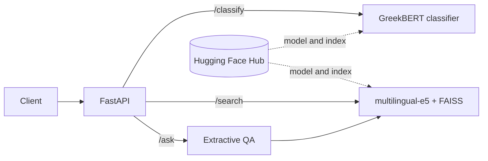
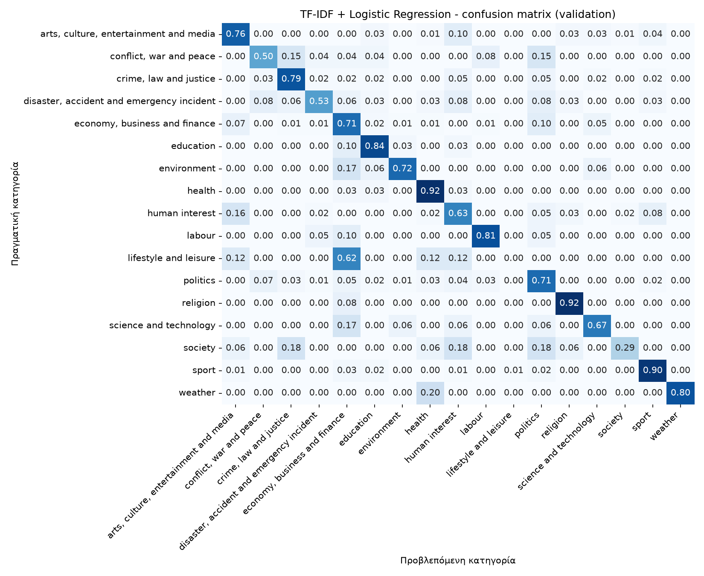
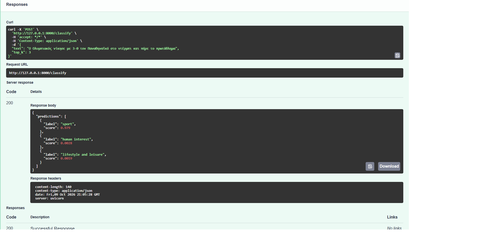
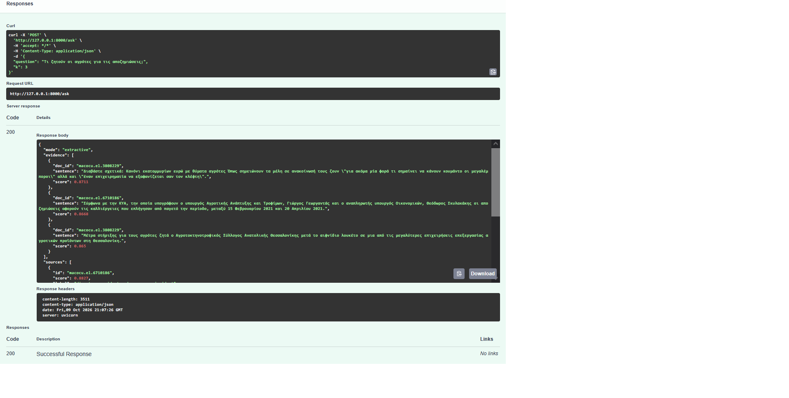

# Greek News NLP API


Greek news classification and retrieval-based extractive question answering served through a REST API: a fine-tuned **GreekBERT** classifier (evaluated against a TF-IDF baseline), semantic search with multilingual-e5 and FAISS, and an extractive `/ask` endpoint that returns cited evidence sentences. Packaged with Docker and tested in CI.

## Architecture



## Results

Evaluated on a held-out test set of 788 Greek news articles (17 IPTC Media Topic categories), never used for training or model selection.

| Model | Accuracy | Macro-F1 |
|---|---|---|
| TF-IDF + Logistic Regression (baseline) | 0.753 | 0.667 |
| **GreekBERT (fine-tuned)** | **0.825** | **0.770** |

Macro-F1 is the main metric because the classes are imbalanced (sport has about 900 articles, weather about 30). The fine-tuned model is published on the Hugging Face Hub with a model card: [Tilemachos-P/greek-news-classifier](https://huggingface.co/Tilemachos-P/greek-news-classifier).



*Confusion matrix of the TF-IDF baseline on the validation set.*

## Retrieval evaluation

Semantic search over the 5,250 Greek articles uses `intfloat/multilingual-e5-small` and a FAISS index. Each article is encoded with the `passage: ` prefix and a maximum sequence length of 256 tokens. Two sets of 300 queries were constructed automatically from sampled articles (seed 42); these are not a benchmark of real user questions.

| Query type | Recall@1 | Recall@5 | Recall@10 | MRR@10 |
|---|---|---|---|---|
| Opening of the article (sanity check, near-verbatim) | 0.997 | 1.000 | 1.000 | 0.998 |
| Sentence sampled after the first 200 whitespace-separated words | 0.327 | 0.463 | 0.530 | 0.386 |

The second evaluation uses sentences sampled after the first 200 whitespace-separated words of articles containing at least 260 words. It is more challenging than the near-verbatim opening queries. However, this word-based selection does not guarantee that every query is fully outside the first 256 tokens embedded by the model. Only the original source article counts as relevant; other articles covering the same event are not credited. These results measure source-article retrieval, not answer correctness.

The retrieval corpus includes all three classification splits as a searchable knowledge base. The classifier is trained only on the training split; retrieval evaluation is a separate task.

## API

| Endpoint | Description |
|---|---|
| `GET /health` | API liveness check; does not verify model or index readiness |
| `POST /classify` | Top-k predicted categories with scores for a Greek text |
| `POST /search` | Semantic search over the article index, returns the top-k articles |
| `POST /ask` | Extractive question answering: the most relevant sentences with article ids, plus the source articles |

Example `/classify` request:

```json
{
  "text": "Η κυβέρνηση ανακοίνωσε νέα μέτρα στήριξης για τους αγρότες λόγω των πλημμυρών",
  "top_k": 3
}
```

Interactive documentation (Swagger) is available at `/docs` when the server is running.

## Demo

Screenshots of the API running locally (Swagger UI).





## Quickstart

Use Python 3.11 inside an activated virtual or Conda environment:

```bash
git clone https://github.com/P-Tilemachos/Greek-News-NLP-API.git
cd Greek-News-NLP-API
python -m pip install -e ".[dev,ml]"
```

Configure the public Hugging Face repositories and start the API.

**Windows — Command Prompt / Anaconda Prompt:**

```bat
set "HF_MODEL_REPO=Tilemachos-P/greek-news-classifier"
set "HF_INDEX_REPO=Tilemachos-P/greek-news-index"
python -m uvicorn greek_nlp.api.main:app --reload
```

**Linux / macOS — Bash:**

```bash
export HF_MODEL_REPO=Tilemachos-P/greek-news-classifier
export HF_INDEX_REPO=Tilemachos-P/greek-news-index
python -m uvicorn greek_nlp.api.main:app --reload
```

Open [Swagger UI](http://127.0.0.1:8000/docs) to try the endpoints. The first request to each component may take longer while its artifacts are downloaded and loaded. Semantic search also loads `intfloat/multilingual-e5-small` from the Hub. Initial downloads require internet access.

Model weights and the search index are not stored in this repository. They are loaded from `models_store/` (`greek-bert-news-classifier/` and `rag_index/`). If a folder is missing, the API downloads it from the Hugging Face Hub, using these environment variables:

| Variable | Purpose |
|---|---|
| `HF_MODEL_REPO` | Hub repository containing the fine-tuned classifier |
| `HF_INDEX_REPO` | Hub repository containing the FAISS index and article texts |
| `HF_TOKEN` | Access token, only needed for private repositories |
| `MODELS_DIR` | Optional: custom location of the local model store |

The index can be rebuilt locally with `python -m greek_nlp.rag.retriever` after running the data notebooks.

## Docker

Run these commands from the repository root with Docker running. The single-line commands work in Bash and Windows Command Prompt / Anaconda Prompt:

```bash
docker build -t greek-news-nlp-api .
docker run --rm -p 8000:8000 -e HF_MODEL_REPO=Tilemachos-P/greek-news-classifier -e HF_INDEX_REPO=Tilemachos-P/greek-news-index greek-news-nlp-api
```

This example does not mount persistent storage, so downloaded artifacts inside the container are removed when it is deleted.

The trained classifier and the search index are public on the Hugging Face Hub: [greek-news-classifier](https://huggingface.co/Tilemachos-P/greek-news-classifier) (model) and [greek-news-index](https://huggingface.co/datasets/Tilemachos-P/greek-news-index) (dataset). No token is needed to download them. For the reproduction workflow, see below.

## Tests and CI

```bash
python -m pytest -q
python -m ruff check .
python -m ruff format --check .
```

The test suite covers API responses and input validation using mocked inference components, plus artifact download path handling and local-folder reuse using a simulated Hub download. Tests do not download model weights or require a Hugging Face token.

CI runs on pushes to `main` and pull requests. Separate jobs run lint, formatting checks and tests, and build the Docker image with a `/health` smoke test. These checks do not establish real-model inference quality or model readiness. Models and the index load lazily on first use.

## Reproducing the experiments

1. Download EMMediaTopic 1.0 from the source linked in [Data](#data) and place `EMMediaTopic-1.0.jsonl` in `data/`.
2. Install notebook dependencies in addition to the API dependencies: `python -m pip install jupyter pandas scikit-learn matplotlib seaborn accelerate`.
3. Run `01_eda.ipynb` and `02_baseline.ipynb` from the `notebooks/` directory to create the splits and evaluate the baseline.
4. Run `03_finetune_greekbert.ipynb` in a GPU-enabled Colab environment. It uses Google Drive paths: upload the split files and adapt `DATA_DIR` to your location. The notebook uses FP16 training.
5. Copy the saved classifier folder to `models_store/greek-bert-news-classifier/`, or upload it to a Hugging Face model repository and configure `HF_MODEL_REPO`.
6. From the repository root, run `python -m greek_nlp.rag.retriever` to build the index from `data/el_train.jsonl`, `data/el_val.jsonl` and `data/el_test.jsonl`.
7. Run `04_retrieval_eval.ipynb` to evaluate retrieval. The index folder can be uploaded to a Hugging Face **dataset** repository and used through `HF_INDEX_REPO`.

Dependencies are not currently locked to exact versions. Library versions and hardware can affect reproducibility; the reported metrics are the saved outputs of the included notebooks.

## Project structure

```
src/greek_nlp/
  api/       FastAPI app and request/response schemas
  core/      model and index download from the Hugging Face Hub
  models/    GreekBERT inference
  rag/       embedding retriever (FAISS) and extractive QA
notebooks/   01 EDA, 02 TF-IDF baseline, 03 GreekBERT fine-tuning (Colab), 04 retrieval evaluation
tests/       pytest suite (models are mocked, so CI needs no weights)
Dockerfile   CPU image of the API
```

## Data

[EMMediaTopic 1.0](http://hdl.handle.net/11356/1991) (Kuzman and Ljubešić, Jožef Stefan Institute), Greek subset: 5,250 news articles, licensed under CC BY-SA 4.0. The data files are not stored in this GitHub repository. The article texts are included in the search index dataset on the Hugging Face Hub ([greek-news-index](https://huggingface.co/datasets/Tilemachos-P/greek-news-index)), which is distributed under the same CC BY-SA 4.0 license. Re-split 70/15/15 (stratified, seed 42) into train, validation and test.

## Limitations

- The labels were assigned automatically by GPT-4o, not by human annotators. Classification metrics therefore measure agreement with these automatic labels, rather than verified human ground truth. Annotation errors and ambiguities may affect both training and evaluation.
- Rare categories (weather, lifestyle and leisure, religion) have very few test examples, so their per-class scores are noisy.
- Test-set performance varies by category, with lower F1 scores for *lifestyle and leisure* and *society*.
- Classification and article embedding use a maximum sequence length of 256 tokens. Later text does not contribute directly to article retrieval, although `/ask` can select sentences from the full text of articles that were retrieved.
- Training uses a class-weighted loss to address imbalance. Its effect was not isolated through an unweighted GreekBERT comparison.
- `/ask` is extractive: it selects sentences from the retrieved articles and does not generate text. Some selected sentences can be scraping leftovers such as "read also" teasers.
- The retrieval evaluation uses automatically generated queries, not real user questions. `/ask` answer quality has not been evaluated separately.
- `/ask` returns the highest-ranked candidate sentences without an answerability threshold. Ambiguous or unsupported questions may therefore return related but unhelpful evidence.
- The article corpus is static and is not a live news feed. Retrieval scores are similarity scores, not calibrated probabilities of correctness.

## Roadmap

- [x] Data exploration, cleaning and stratified split
- [x] TF-IDF baseline
- [x] GreekBERT fine-tuning and test-set evaluation
- [x] `/classify` endpoint with tests and CI
- [x] Semantic retrieval with `/search`, evaluated with Recall@k and MRR
- [x] Extractive `/ask` endpoint returning cited evidence sentences
- [x] Dockerfile and Docker build check in CI
- [x] Model card on the Hugging Face Hub
- [ ] Public live demo (attempted on Hugging Face Spaces, blocked by the free-tier CPU quota)
- [ ] Chunked retrieval (overlapping passages) to index the full text of each article
- [ ] Optional generated answers when an LLM API key is configured

## License

The code is released under the MIT License (see `LICENSE`). The classifier is fine-tuned from [GreekBERT](https://huggingface.co/nlpaueb/bert-base-greek-uncased-v1) (MIT License, Copyright (c) 2020 NLP AUEB Group). The article texts in the index dataset are licensed under CC BY-SA 4.0 (see [Data](#data)).
