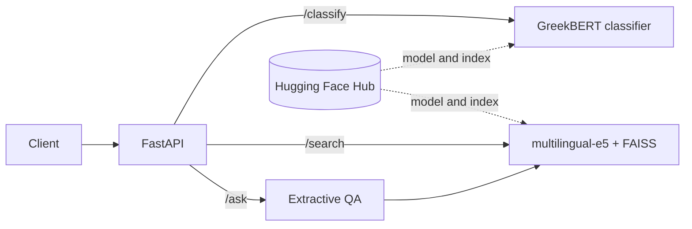

# Greek News NLP API


Greek news classification and retrieval-augmented question answering served through a REST API: a fine-tuned **GreekBERT** classifier (evaluated against a TF-IDF baseline), semantic search with multilingual-e5 and FAISS, and an extractive `/ask` endpoint that returns cited evidence sentences. Packaged with Docker and tested in CI.

## Architecture



## Results

Evaluated on a held-out test set of 788 Greek news articles (17 IPTC Media Topic categories), never used for training or model selection.

| Model | Accuracy | Macro-F1 |
|---|---|---|
| TF-IDF + Logistic Regression (baseline) | 0.753 | 0.667 |
| **GreekBERT (fine-tuned)** | **0.825** | **0.770** |

Macro-F1 is the main metric because the classes are imbalanced (sport has about 900 articles, weather about 30).


*Confusion matrix of the TF-IDF baseline on the validation set.*

## Retrieval evaluation

Semantic search over the 5,250 Greek articles uses `intfloat/multilingual-e5-small` and a FAISS index; each article is embedded from its first 256 tokens. Queries were generated automatically from 300 random articles, so this is an easier test than real user questions.

| Query type | Recall@1 | Recall@5 | Recall@10 | MRR@10 |
|---|---|---|---|---|
| Opening of the article (sanity check, near-verbatim) | 0.997 | 1.000 | 1.000 | 0.998 |
| Sentence from the later part of the article (not in the indexed text) | 0.327 | 0.463 | 0.530 | 0.386 |

The second row is the informative one: the query sentence is not part of the embedded text, so the system has to match the article by topic alone. Many news articles cover near-identical subjects while only one counts as correct, so these numbers are conservative.

## API

| Endpoint | Description |
|---|---|
| `GET /health` | Health check |
| `POST /classify` | Top-k predicted categories with scores for a Greek text |
| `POST /search` | Semantic search over the article index, returns the top-k articles |
| `POST /ask` | Extractive question answering: the most relevant sentences with article ids, plus the source articles |

Example `/classify` request:

```json
{
  "text": "Η κυβέρνηση ανακοίνωσε νέα μέτρα στήριξης για τους αγρότες λόγω των πλημμυρών",
  "top_k": 3
}
```

Interactive documentation (Swagger) is available at `/docs` when the server is running.

## Quickstart

```bash
git clone https://github.com/P-Tilemachos/Greek-News-NLP-API.git
cd Greek-News-NLP-API
pip install -e ".[dev,ml]"
uvicorn greek_nlp.api.main:app --reload
```

Model weights and the search index are not stored in this repository. They are loaded from `models_store/` (`greek-bert-news-classifier/` and `rag_index/`). If a folder is missing, the API downloads it from the Hugging Face Hub, using these environment variables:

| Variable | Purpose |
|---|---|
| `HF_MODEL_REPO` | Hub repository containing the fine-tuned classifier |
| `HF_INDEX_REPO` | Hub repository containing the FAISS index and article texts |
| `HF_TOKEN` | Access token, only needed for private repositories |
| `MODELS_DIR` | Optional: custom location of the local model store |

The index can be rebuilt locally with `python -m greek_nlp.rag.retriever` after running the data notebooks.

## Docker

```bash
docker build -t greek-news-nlp-api .
docker run -p 8000:8000 \
  -e HF_MODEL_REPO=<username>/<classifier-repo> \
  -e HF_INDEX_REPO=<username>/<index-repo> \
  greek-news-nlp-api
```

The CI pipeline runs lint, format checks and tests on every push, then builds the Docker image and checks that the container answers on `/health`. The classifier and index are loaded lazily on the first request, so the container starts quickly.

## Project structure

```
src/greek_nlp/
  api/       FastAPI app and request/response schemas
  core/      model and index download from the Hugging Face Hub
  models/    GreekBERT inference
  rag/       embedding retriever (FAISS) and extractive QA
notebooks/   01 EDA, 02 TF-IDF baseline, 03 GreekBERT fine-tuning (Colab), 04 retrieval evaluation
tests/       pytest suite (models are mocked, so CI needs no weights)
Dockerfile   CPU image of the API
```

## Data

[EMMediaTopic 1.0](http://hdl.handle.net/11356/1991) (Kuzman and Ljubešić, Jožef Stefan Institute), Greek subset: 5,250 news articles, licensed under CC BY-SA 4.0. The data is not redistributed in this repository. Re-split 70/15/15 (stratified, seed 42) into train, validation and test.

## Limitations

- The labels were assigned automatically by GPT-4o, not by human annotators. The dataset authors report a macro-F1 of 0.731 for these labels against a manually annotated sample, which caps what any model can reach.
- Rare categories (weather, lifestyle and leisure, religion) have very few test examples, so their per-class scores are noisy.
- The classifier struggles most with broad, overlapping categories such as *society* and *human interest*.
- Texts are truncated to 256 tokens for both classification and indexing, so later parts of long articles are not searchable.
- A class-weighted loss improves recall on small classes at the cost of precision.
- `/ask` is extractive: it selects sentences from the retrieved articles and does not generate text. Some selected sentences can be scraping leftovers such as "read also" teasers.
- The retrieval evaluation uses automatically generated queries, not real user questions.

## Roadmap

- [x] Data exploration, cleaning and stratified split
- [x] TF-IDF baseline
- [x] GreekBERT fine-tuning and test-set evaluation
- [x] `/classify` endpoint with tests and CI
- [x] Semantic retrieval with `/search`, evaluated with Recall@k and MRR
- [x] Extractive `/ask` endpoint returning cited evidence sentences
- [x] Dockerfile and Docker build check in CI
- [ ] Cloud deployment with a live demo
- [ ] Chunked retrieval (overlapping passages) to index the full text of each article
- [ ] Optional generated answers when an LLM API key is configured
- [ ] Model card